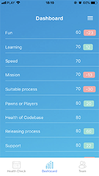

# Team Health Check (mobile)
<div>
    
    
    
</div>

## Getting started
1. Configure `.env` file according [configuration](#configuration) section
1. Run `npm i`
1. Run `npm start`

And enjoy coding.

## Configuration
Create `.env` file in the root folder with app parameters

- CLIENT_ID - aws 'userPoolWebClientId'
- USER_POOL_ID - aws user pool id
- API_URL - aws http api gateway address
- WEBSOCKET_URL - aws websocket api gateway address

example of .env file with staging environment parameters :
```
CLIENT_ID=7j048gs5jnvh1b2oe6sighllvd
USER_POOL_ID=eu-west-2_wZIIzNgND

API_URL=https://mi9640dq32.execute-api.eu-west-2.amazonaws.com/staging
WEBSOCKET_URL=wss://hekrlj5pk0.execute-api.eu-west-2.amazonaws.com/Test/
```
